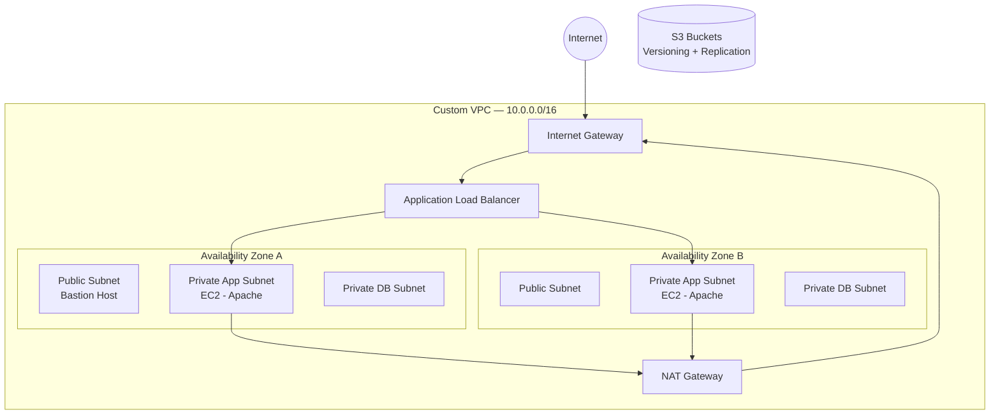

# AWS Three-Tier Web Architecture with Terraform

A production-style, highly available web application infrastructure on AWS, provisioned entirely with Terraform (Infrastructure as Code). The architecture spans three tiers — web, application, and data — across two Availability Zones, with a load balancer, auto scaling, a bastion host for secure administration, and remote state management in Terraform Cloud.

## Architecture



## Key Features

- **Custom VPC** (`10.0.0.0/16`) with six subnets — two public, two private (app), and two isolated private (database) — spread across two Availability Zones for high availability.
- **Application Load Balancer** distributing HTTP traffic across an **Auto Scaling Group** of EC2 instances (min 1 / desired 3 / max 5), with health checks and a launch template.
- **Bastion host** in a public subnet as the single secure SSH entry point into the private application tier.
- **NAT Gateway** giving private-tier instances outbound internet access (for patching/updates) without exposing them publicly.
- **IAM roles and instance profiles** attached to EC2 instances following least-privilege patterns.
- **User-data bootstrap** (`web-script.sh`) that installs Apache and serves a page displaying live instance metadata via IMDSv2.
- **S3 buckets** with public-access blocking, versioning, and cross-bucket replication managed by a dedicated IAM replication role.
- **Isolated data tier**: dedicated database subnets across both AZs, ready for a Multi-AZ RDS MySQL deployment (configuration included in `Database.tf`).
- **Remote state** managed in **Terraform Cloud** for safe, collaborative infrastructure changes.

## Tech Stack

- **Terraform** `~> 1.x` (AWS provider `~> 5.35`)
- **AWS**: VPC, EC2, ALB, Auto Scaling, NAT Gateway, IAM, S3
- **Terraform Cloud** for remote state
- **Bash** for instance bootstrapping

## Project Structure

| File | Purpose |
|------|---------|
| `main.tf` | Provider config, Terraform Cloud backend, tags, outputs |
| `VPC.tf` | VPC, subnets, route tables, Internet Gateway, NAT Gateway |
| `alb.tf` | Application Load Balancer, target group, listener, security group |
| `Web-App.tf` | EC2 launch template, Auto Scaling Group, bastion host, IAM roles |
| `Database.tf` | RDS MySQL configuration for the data tier |
| `S3.tf` | S3 buckets, versioning, and replication configuration |
| `variables.tf` | Input variables (CIDR blocks, instance sizes, ASG capacity) |
| `web-script.sh` | EC2 user-data bootstrap script (installs Apache) |

## Getting Started

### Prerequisites

- An AWS account and credentials configured locally (`aws configure`)
- [Terraform](https://developer.hashicorp.com/terraform/downloads) installed
- A [Terraform Cloud](https://app.terraform.io/) account (or switch the backend in `main.tf` to local/S3 state)
- An SSH key pair for the bastion host

### Deploy

```bash
# 1. Generate an SSH key for the bastion host (referenced by the key pair resource)
ssh-keygen -t rsa -b 4096 -f ./project-key

# 2. Initialize Terraform and download providers
terraform init

# 3. Review the execution plan
terraform plan

# 4. Apply the configuration
terraform apply
```

After a successful apply, Terraform outputs the load balancer DNS name. Open it in a browser to see the running web application.

### Tear Down

```bash
terraform destroy
```

## What I Learned

- Designing a multi-tier, multi-AZ network from the ground up: subnetting, routing, and the public/private tier boundary.
- The difference between an Internet Gateway and a NAT Gateway, and when each is needed.
- Wiring an Auto Scaling Group to an ALB target group via launch templates.
- Managing remote Terraform state and workspaces in Terraform Cloud.
- Structuring reusable Terraform with variables instead of hard-coded values.

## Planned Improvements

- Restrict bastion SSH ingress to a specific admin IP instead of `0.0.0.0/0`.
- Scope the EC2 IAM policy down from `ec2:*` to only the actions required.
- Move the internet-facing ALB into the public subnets and keep app instances private.
- Enable the Multi-AZ RDS data tier and store credentials in AWS Secrets Manager.
- Add HTTPS (ACM certificate + port 443 listener) and refactor into reusable modules.

---

*Built as a hands-on project to demonstrate Infrastructure as Code and AWS architecture fundamentals.*

